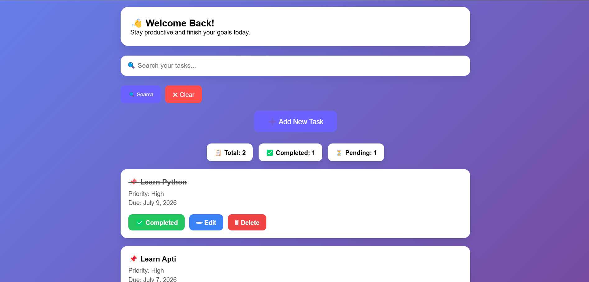
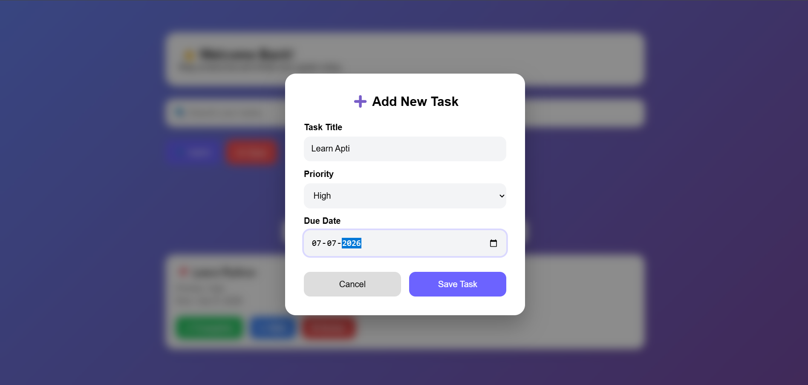

# 📝 TaskFlow

A modern Task Management Web Application built using Django.
TaskFlow is a simple and user-friendly To-Do List web application built with Django. It helps users organize their daily tasks by allowing them to create, update, and delete tasks through a clean and responsive interface.

## 🚀 Live Demo

🌐 https://taskflow-klgb.onrender.com/

## 📂 GitHub Repository

🔗 https://github.com/Aaysha05/TaskFlow

---


## 🚀 Features

- ➕ Add Tasks
- ✏️ Edit Tasks
- ✅ Mark Tasks as Complete
- 🗑 Delete Tasks
- 🔍 Search Tasks
- 🌙 Dark Mode
- 📊 Task Statistics
- 📅 Due Date
- 🎯 Priority Levels
- 📱 Responsive Design
- ☁️ Deployed on Render

## 🛠 Tech Stack

- Python
- Django
- HTML5
- CSS3
- JavaScript
- SQLite

## 📂 Project Structure

```
TaskFlow/
│── manage.py
│── db.sqlite3
│── static/
│── templates/
│── todo/
│── todo_project/
```

## ⚙️ Installation

```bash
git clone https://github.com/Aaysha05/TaskFlow.git

cd TaskFlow

pip install django

python manage.py runserver
```

Open:

```
http://127.0.0.1:8000/
```

## 📸 Screenshots

### 🏠 Home Page


---

### 📋 Dashboard



---

### ➕ Add Task




## 👩‍💻 Author

**Aaysha Nazeem**

-GitHub: https://github.com/Aaysha05
-LinkedIn: www.linkedin.com/in/aayshanazeem

---
⭐ If you like this project, don't forget to star the repository.
